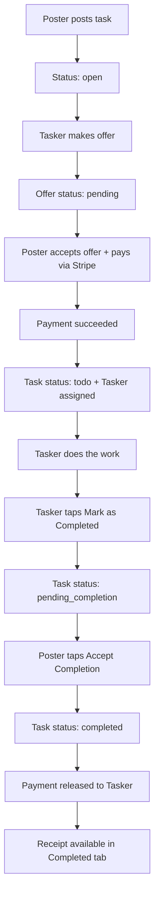

# MyToDoo — Complete Task, Payment & Status Flow Guide

**Document purpose:** Explain the full Poster + Tasker journey in the MyToDoo app — from posting a task to payment release and invoice/receipt.  
**Audience:** Clients, support team, and developers.  
**Last updated:** July 2026  
**Verified against:** Live server database + logs + mobile codebase + backend codebase.

---

## 1. Quick answer — “Why does it say Waiting for poster to accept?”

If a **Tasker** sees **“Waiting for poster to accept”** on a task in **Todoo Tasks**, it usually does **NOT** mean the offer was rejected.

It means:

1. The offer **was already accepted** and payment **was successful**.
2. The Tasker **already tapped “Mark as Completed”**.
3. The task is now waiting for the **Poster to tap “Accept Completion”** in the app.

**Saying “I accepted” on the phone is not enough.** The Poster must complete the action **inside the MyToDoo app**.

Until the Poster does that:

- Task status on server = `pending_completion`
- Tasker will **not** see “Mark as Completed” again (that step is already done)
- Payment is **not released** to the Tasker yet
- Invoice / receipt is **not** available in the Completed tab yet

---

## 2. Roles — who is who?

| Role | Who | Main job |
|------|-----|----------|
| **Poster** | Person who created the task | Reviews offers, pays, confirms work is done |
| **Tasker** | Person who made an offer | Does the work, marks task complete |

One person can only be Poster **or** Tasker on a single task — not both.

---

## 3. Full lifecycle — simple overview



---

## 4. Every step — backend status, payment, and what each person sees

### Step 1 — Task posted

| | |
|---|---|
| **Backend task status** | `open` |
| **Offer status** | (no offer yet) |
| **Payment** | None |
| **Poster — My Tasks tab** | **Posted** |
| **Poster sees** | Edit / delete task; offers may arrive |
| **Tasker** | Sees task in **Find** / Browse; can make offer |

---

### Step 2 — Tasker makes an offer

| | |
|---|---|
| **Backend task status** | `open` |
| **Offer status** | `pending` |
| **Payment** | None |
| **Poster — My Tasks tab** | **Posted** (task still open) |
| **Tasker — My Tasks tab** | **Open Offers** |
| **Tasker sees** | “Waiting for the task poster to review your offer” |
| **Poster sees** | Offer on task detail → can **Accept Offer** |

---

### Step 3 — Poster accepts offer + pays

| | |
|---|---|
| **What happens** | Poster taps **Accept Offer** → Stripe payment sheet opens → payment succeeds |
| **Backend offer status** | `accepted` |
| **Backend task status** | `todo` (Tasker is assigned) |
| **Transaction paymentStatus** | `succeeded` |
| **Payment record status** | `completed` (held — **not released yet**) |
| **Poster — My Tasks tab** | **Accepted** |
| **Tasker — My Tasks tab** | **Todoo Tasks** |
| **Tasker sees** | **Mark as Completed** button + Chat (when status is `todo`) |
| **Poster sees** | Task in Accepted tab; work in progress |

**Important:** Money is **charged/captured into escrow** at this step. It is **not paid out to the Tasker yet**.

---

### Step 4 — Tasker completes the work

| | |
|---|---|
| **Who acts** | Tasker only |
| **Action** | Tap **Mark as Completed** |
| **API** | `PATCH /tasks/:taskId/complete` |
| **Backend task status** | `pending_completion` |
| **Fields set** | `doneAt` = timestamp |
| **Poster — My Tasks tab** | **Accepted** |
| **Tasker — My Tasks tab** | **Todoo Tasks** |
| **Tasker sees** | Yellow badge: “Waiting for poster to accept” *(wording is confusing — see Section 9)* |
| **Poster sees** | **Accept Completion** button |
| **Payment** | Still **not released** |

---

### Step 5 — Poster confirms completion

| | |
|---|---|
| **Who acts** | Poster only |
| **Action** | Tap **Accept Completion** (or “Confirm Completion” on task detail) |
| **API** | `PATCH /tasks/:taskId/confirm-completion` |
| **Backend task status** | `completed` |
| **Fields set** | `completedAt` = timestamp |
| **Payment record status** | `released` |
| **What happens to money** | Payment released / captured to Tasker payout flow |
| **Poster — My Tasks tab** | **Completed** |
| **Tasker — My Tasks tab** | **Completed** |
| **Both see** | **View Receipt** button, optional **Review** |

---

## 5. Status reference table (backend → app)

| Backend `task.status` | Meaning | Poster tab | Tasker tab | Tasker button | Poster button |
|----------------------|---------|------------|------------|---------------|---------------|
| `open` | Waiting for offers | Posted | Open Offers* | Delete offer | Accept offer (on detail) |
| `todo` | Paid & assigned; work in progress | Accepted | Todoo Tasks | **Mark as Completed** | Chat / Cancel |
| `pending_completion` | Tasker finished; poster must confirm | Accepted | Todoo Tasks | Waiting badge | **Accept Completion** |
| `completed` | Fully done | Completed | Completed | View Receipt / Review | View Receipt / Review |
| `cancelled` | Cancelled | Cancelled | Cancelled | — | — |
| `overdue` | Past due date | Overdue | Overdue | — | — |

\*Tasker sees the task under **Open Offers** when their **offer** status is `pending`, not based on task status alone.

---

## 6. Payment flow — when money moves

### Stage A — Poster pays (offer acceptance)

- Poster pays: task amount + service fees + connection fees (as shown in payment sheet).
- Stripe `paymentIntent` status → `succeeded`.
- Server sets: `transaction.paymentStatus = succeeded`, `task.status = todo`.
- **Tasker does NOT receive payout yet.**

### Stage B — Work in progress (`todo`)

- Money is held by the platform (escrow model).
- Tasker works on the task.

### Stage C — Tasker marks complete (`pending_completion`)

- No new charge.
- No payout yet.
- Waiting for Poster confirmation.

### Stage D — Poster accepts completion (`completed`)

- Server runs `posterConfirmCompletionService`.
- Payment status → `released`.
- Tasker net amount credited to financial / payout system.
- Tasker can see payout in **Account → Payout history** (after Stripe Connect setup).

### Payment status summary

| Payment record `status` | When |
|-------------------------|------|
| `pending` | Payment started, not finished |
| `completed` | Poster paid; money held |
| `released` | Poster confirmed completion; Tasker payout triggered |
| `refunded` | Refund issued |
| `failed` | Payment failed |

---

## 7. Invoice / receipt — when is it available?

| Stage | Receipt available? |
|-------|------------------|
| Before payment | No |
| After payment (`todo`) | No — task not finished |
| `pending_completion` | No — task not finished |
| `completed` | **Yes** — both Poster and Tasker |

**Where to find it:**

1. **My Tasks** → switch to **Completed** tab  
2. Open the task card  
3. Tap **View Receipt** (receipt icon)  
4. Can download / share PDF from the receipt screen  

Receipt includes: task title, amounts, service fees, connection fees, poster total paid, tasker net receives (when available from backend).

---

## 8. My Tasks tabs — Poster vs Tasker

### Poster tabs

| Tab | What appears |
|-----|--------------|
| **Posted** | Tasks still `open` — waiting for offers |
| **Accepted** | Paid tasks in progress (`todo`, `pending_completion`, etc.) |
| **Completed** | Finished tasks — receipt & review |
| **Overdue** | Past due |
| **Cancelled** | Cancelled tasks |

### Tasker tabs

| Tab | What appears |
|-----|--------------|
| **Open Offers** | Offers still `pending` — not yet accepted/paid |
| **Todoo Tasks** | Assigned active work (`todo`, `pending_completion`, etc.) |
| **Completed** | Finished tasks — receipt & review |
| **Overdue** | Past due |
| **Cancelled** | Cancelled tasks |

---

## 9. Known UI wording issue (minor — not a flow bug)

On the Tasker side, when status is `pending_completion`, the app shows:

> **“Waiting for poster to accept”**

This text is **misleading**. The Poster already accepted the **offer**.  
The correct meaning is:

> **“Waiting for poster to confirm completion”**

The **logic is correct** (hide Mark as Completed, show waiting state). Only the **label text** should be improved in a future app update.

---

## 10. Real case study — verified on LIVE server (July 2026)

### Task: “Help moving Office furniture”

| Field | Server value |
|-------|--------------|
| Task ID | `6a459340d5c23e4ed4dc3dc5` |
| Poster | Jeremy Sher (`jeremysher92@gmail.com`) |
| Tasker | Kanchana Ratnayake (`kanchanar@insanetoys.com.au`) |
| Offer status | `accepted` ✅ |
| Payment | `succeeded` — $101.95 AUD ✅ |
| Task assigned | Jul 2, 2026 01:49 UTC ✅ |
| Tasker marked complete | Jul 2, 2026 06:19 UTC ✅ |
| **Current task status** | `pending_completion` ⏳ |
| **completedAt** | `null` ❌ |
| Poster confirm-completion API | **Never called** ❌ |

### Timeline from server logs

```
01:49 — Jeremy (Poster) paid successfully → task status: todo
06:19 — Kanchana (Tasker) tapped Mark as Completed → status: pending_completion
After   — No posterConfirmCompletion log → Jeremy has NOT confirmed in the app
```

### What each person should do now

**Jeremy (Poster):**

1. Open MyToDoo app  
2. **My Tasks** → select **Poster** role  
3. Go to **Accepted** tab  
4. Find “Help moving Office furniture”  
5. Tap **Accept Completion**  
6. After success → task moves to **Completed** → **View Receipt** available  

**Kanchana (Tasker):**

- No action needed except wait for Poster to confirm in the app  
- After confirmation → task appears in **Completed** → payout process continues → **View Receipt** available  

---

## 11. FAQ — common confusions

### “Offer accept කළා නම් Mark as Completed පෙන්වන්න ඕන නේ?”

**ඔව්** — but only while status is `todo`.  
If status is already `pending_completion`, the Tasker **already** pressed Mark as Completed. The next step is Poster **Accept Completion**.

### “Phone එකේ accept කළා කිව්වා විතරක් ප්‍රමාණවත්ද?”

**නැහැ.** Server එකට record වෙන්න app එකෙන් button tap කරන්න ඕන.

### “Payment කළා නම් Tasker ට මුදල් ගියාද?”

**නැහැ තවම.** Payment at offer accept = money held.  
Tasker gets payout only after Poster **Accept Completion** (`payment status = released`).

### “Invoice / receipt කවදා ලැබෙනවා?”

Task status `completed` වුණාට පස්සේ — **Completed** tab → **View Receipt**.

### “මේක app bug එකක්ද?”

**Flow bug නෙවෙයි.** Server data and app display match.  
The stuck task is waiting for **Poster action in the app**.  
Only minor issue: confusing label text on Tasker waiting badge (Section 9).

### “Same person Posterත් Taskerත් වෙන්න පුළුවන්ද?”

**නැහැ** — you cannot make an offer on your own task.

---

## 12. API endpoints (for developers)

| Action | Who | Endpoint |
|--------|-----|----------|
| Accept offer + pay | Poster | `POST /tasks/:taskId/offers/:offerId/accept` + Stripe |
| Mark as completed | Tasker | `PATCH /tasks/:taskId/complete` |
| Confirm completion | Poster | `PATCH /tasks/:taskId/confirm-completion` |
| My tasks (tasker) | Tasker | `GET /tasks/my-tasks?role=tasker` |
| My tasks (poster) | Poster | `GET /tasks/my-tasks?role=poster` |

### Valid status transitions (backend)

```
open  →  todo  →  pending_completion  →  completed
```

---

## 13. Support checklist

When a client reports “stuck on waiting”:

1. Ask for **task title** and **Poster / Tasker emails**  
2. Check server: `task.status`, `offer.status`, `paymentStatus`, `doneAt`, `completedAt`  
3. If `pending_completion` + `completedAt = null` → tell Poster to tap **Accept Completion**  
4. If `todo` → tell Tasker to tap **Mark as Completed**  
5. If `open` + offer `pending` → tell Poster to **Accept Offer + Pay**  
6. If `completed` → direct both to **Completed** tab for receipt  

---

## 14. Summary (one paragraph for client)

MyToDoo uses a **two-step finish**: the Tasker marks work done, then the Poster confirms in the app. Payment to the Tasker is released only after that second step. If the Tasker sees a “waiting” message instead of “Mark as Completed”, the offer was already accepted and the Tasker already completed their step — the Poster must open the app, go to **My Tasks → Poster → Accepted**, and tap **Accept Completion**. Receipts appear only after the task reaches **Completed**.

---

*Document generated from production investigation + codebase review. For internal support use.*
